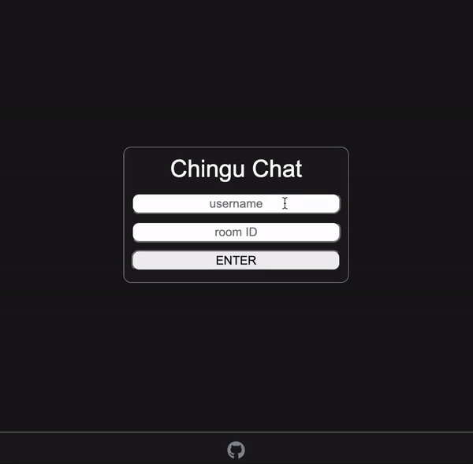

# Chingu-Chat

This is a chat application where a user inputs a username and the desired room ID, and can join the chat and communicate in real-time.

> Project developed in a pair-programming session arranged by the Chingu.io team

## Table of contents

- [Overview](#overview)
  - [The Goal](#the-goal)
  - [Screenshots](#screenshots)
  - [Links](#links)
- [Our Process](#our-process)
  - [Built With](#built-with)
  - [Session Logs](#session-logs)
    - [Session 1](#session-1)
    - [Session 2](#session-2)
    - [Session 3](#session-3)
- [Contributors](#contributors)
- [License](#license)

## Overview

### The Goal

The goal was to build a real-time chat interface where multiple users can interact with each other by sending messages.

### Screenshots

### Links

- GitHub: [github.com/medic1111/pair-session-chat](https://github.com/medic1111/pair-session-chat)
- Live Site: [chingu-chat.onrender.com/](https://chingu-chat.onrender.com/)

## Our Process

### Built With

- Frontend
  - React.js
- Backend
  - Node.js
  - Express
  - Socket.io
- Tech
  - Discord
  - VS Code live-share extension
  - git/Github

### Session Logs

#### Session 1:

- Duration: 1:30
- Objectives:
  - [x] Choose project
  - [x] Plan Session platforms
  - [x] Set a schedule
  - [x] Development of project structure
  - [x] Install all needed dependencies
  - [x] Development of server
  - [x] Rough blueprint of client
  - [x] Ensure client/server communication
  - [x] Determine client _states_
  - [x] Work with dummy data rendering
  - [x] Deploy development version
- After Session
  - John: Implement UI/UX on CHAT, Client structure

#### Session 2:

- Duration: 1:30
- Objectives:
  - [x] Integrate Socket.io client
  - [x] Integrate Socket.io server
  - [x] Manual testing
  - [x] Update development deployed version
  - [x] Manual live testing
- After Session
  - John: Implement UI/UX on LOGIN, Client structure and clean-up
  - Aryse: Transfer useState to useContext, implement auto scrolling to bottom on CHAT, delete unused dependencies

#### Session 3:

- Duration: 1hr
- Objectives:
  - [x] Code review
  - [x] Testing
  - [x] Address bugs if any found
  - [x] Deploy Production version
  - [x] Enhance documentation
  - [x] Add MIT license
  - [x] Consider future features
  - [x] Celebrate
- After Session
  - John: update login card placement, enhance README docs

### Contributors

**:point_right: Aryse Tansy**
:e-mail: paganowebdev@gmail.com
:computer: [Portfolio](https://www.pagano.dev/)

**:point_right: John Malapit**
:e-mail: [contact@johnmal.dev](mailto:contact@johnmal.dev)
:computer: [Portfolio](https://www.johnmal.dev/)

### License
MIT License
Copyright (c) 2022 Aryse Gabrielle Pagano & John Malapit
