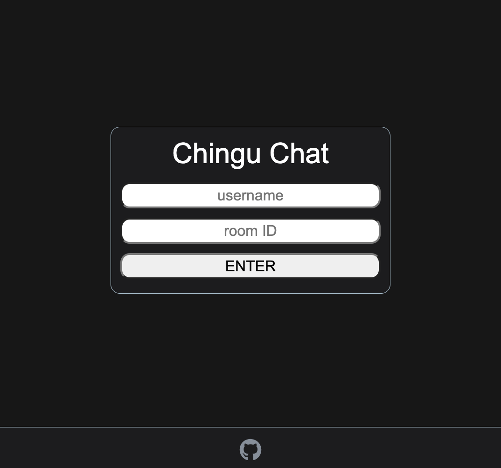
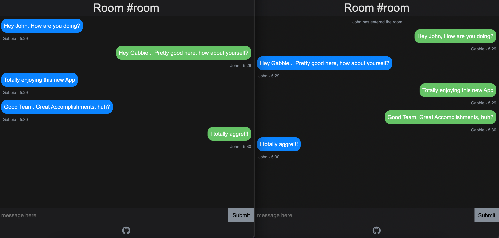

# Chingu-Chat

> Project developed in a pair-programming session arranged by the Chingu.io team

**CONTRIBUTORS:**

---

:point_right: Aryse Tansy

:e-mail: paganowebdev@gmail.com

:computer: [Portfolio](https://www.pagano.dev/)

---

:point_right: John Malapit

:e-mail: contact@johnmal.dev

:computer: [Portfolio](https://www.johnmal.dev/)

---

## The Project

Chat application where a login user inputs a desired room id, and is able to join the chat and communicate real time

[Live here](https://chingu-chat.herokuapp.com/)

## Tech

- Frontend:

  - React.js

- Backend:
  - Node.js
  - Express
  - Socket.io

### Pair-Programming quick summary

- Discord
- VS Code live-share extension
- git/Github
- Total meetings: 3

#### MEETING ONE:

- Duration: 1:30
- Objective:
  - [x] Choose project
  - [x] Plan meeting platforms
  - [x] Set a schedule
  - [x] Development of project structure
  - [x] Install all needed dependencies
  - [x] Development of server
  - [x] Rough blueprint of client
  - [x] Ensure client/server communication
  - [x] Determine client _states_
  - [x] Work with dummy data rendering
  - [x] Deploy development version

_After_ _Meeting_

> John: Implement UI/UX on CHAT, Client structure

#### MEETING TWO:

- Duration: 1:30
- Objective:
  - [x] Integrate Socket.io client
  - [x] Integrate Socket.io server
  - [x] Manual testing
  - [x] Update development deployed version
  - [x] Manual live testing

_After_ _Meeting_

> John: Implement UI/UX on LOGIN, Client structure and clean-up

> Aryse: Transfer useState to useContext, implement auto scrolling to bottom on CHAT, delete unused dependencies

#### MEETING THREE:

- Duration: 1hr
- Objective:
  - [x] Code review
  - [x] Testing
  - [x] Address bugs if any found
  - [x] Deploy Production version
  - [ ] Enhance documentation
  - [x] Add MIT license
  - [x] Consider future features
  - [x] Celebrate
